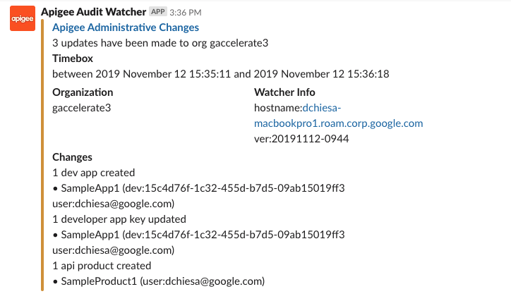

# Apigee Audit Watcher in nodejs

This is a nodejs program that polls the Apigee audit trail, and
then invokes webhooks with notification of changes.

Today the outbound connections include: Slack, Google Chat, and Hipchat.

For example, an alert to slack looks like this:




Possible extensions include: Microsoft Teams, Splunk log, other logging systems.

## License

This code is Copyright (c) 2019-2020 Google LLC, and is released under the
Apache Source License v2.0. For information see the [LICENSE](LICENSE) file.

## Disclaimer

This tool is not an official Google product, nor is it part of an official Google product.

## Running the program

This program depends on node v10 or greater, and npm v6 or greater.
Make sure you have those things installed.

Then, running the program is as easy as 1,2,3:

1. install pre-requisites

2. fill in the config/config.json file

3. invoke the program


More details below.

## 1. Install pre-requisites

This is a one-time thing. After you clone the repo, just install like this:

```
npm install
```

## 2. Provide the Configuration

Provide a file in the config directory named `config.json`.
This file tells the program:

* which Apigee organization to watch
* how often to check the audit trail for updates (typically 10 minutes)
* where to post notification of any observed updates

The contents should be like this:
```json
{
  "organization": "my-org-name",
  "timezone": "America/Los_Angeles",
  "sleepTime" : "10m",
  "loglevel" : 3,
  "alert" : {
    ...
  }
}
```

Some of those fields are self-explanatory.

The `timezone` is optional. It is the zone in which times will be expressed, in outbound
notifications, to Slack and so on. If you leave it blank, it will default to US
West-coast time ("America/Los_Angeles").

The `sleepTime` specifies the amount of time the script should wait before
polling the audit trail. The `sleepTime` can be expressed as a number followed
by a letter to indicate the timeunit as seconds, minutes, hours.  For example,
`1h` is one hour, `4m` is 4 minutes. The sleepTime should not be more than 10
hours. (For now the lookback is hardcoded at 10 hours; so if you configure the
script to wait longer than 10 hours then this script will miss audit records.)

For the `alert` you have several options: `slack`, `googlechat`, or `hipchat`.

To set up slack, you need to visit the [webhooks
page](https://api.slack.com/messaging/webhooks), create an App, enable it as an
incoming webhook, and copy the resulting URL.

Then use this as the alert:
```
  "alert" : {
    "type" : "slack",
    "uri" : "https://hooks.slack.com/services/LOCATION/DEPENDENT/PATH"
  },
```

To set up googlechat, follow the
[example](./config/example-config-googlechat.json).
Likewise, for hipchat, follow the
[example](./config/example-config-hipchat.json).


A complete configuration file, with the required and `alert` fields, might look like this:

```json
{
  "organization": "my-org-name",
  "timezone": "America/Los_Angeles",
  "sleepTime" : "10m",
  "alert" : {
    "type" : "slack",
    "uri" : "https://hooks.slack.com/services/LOCATION/DEPENDENT/PATH"
  }
}
```


## 3. Run the program

You will need to specify options for connecting to Apigee. Specifically the authentication mechanism.
Use one of these options:
* `-n` to specify to retrieve username and password from the local .netrc file
* `-u USERNAME` to specify a username
* `-p PASSWORD` to specify a password.  This only works if you specify `-u`. Not always required though.
* `-C CODE` to specify a one-time passcode, possibly for use with -n or -u
* `-Z ZONE` to specify a zone-name, for Apigee SSO.

```
npm run watch -- <OPTIONS>
```

## Logging

By default, the program will log its operations. You can increase or decrease
the level of logging with the `loglevel` setting in the config.json file.

The output at loglevel=3 looks like this:

```
$ npm run watch

> audit-watcher@1.0.1 watch /Users/dchiesa/dev/node/apigee-audit-watcher
> node ./auditWatcher.js

[2019-Nov-12 15:27:48] audit watcher version 20191112-0944
[2019-Nov-12 15:27:48] listening on port 5950
[2019-Nov-12 15:27:48] log level is: 3
[2019-Nov-12 15:27:48] POST https://login.apigee.com/oauth/token
[2019-Nov-12 15:27:49] ==> 200
[2019-Nov-12 15:27:49] GET https://api.enterprise.apigee.com/v1/audits/organizations/gaccelerate3?expand=true&startTime=1573565269799&endTime=1573601269799
[2019-Nov-12 15:27:53] ==> 200
[2019-Nov-12 15:27:53] got 4 records
[2019-Nov-12 15:27:53] sleeping 1 minute
[2019-Nov-12 15:27:53] wake at 15:28:53
[2019-Nov-12 15:28:53] GET https://api.enterprise.apigee.com/v1/audits/organizations/gaccelerate3?expand=true&startTime=1573565333079&endTime=1573601333079
[2019-Nov-12 15:28:55] ==> 200
[2019-Nov-12 15:28:55] got 4 records
[2019-Nov-12 15:28:55] fireWebhooks - no alerts
[2019-Nov-12 15:28:55] sleeping 1 minute
[2019-Nov-12 15:28:55] wake at 15:29:55
...
```

## How does it work?

The tool polls the audit trail for an Apigee Edge organization, available at
https://api.enterprise.apigee.com/v1/audits/organizations/ORGNAME .  It passes
the expand=true and a startTime and endTime parameter to limit the records
returned.  The watcher is set to run every 10 minutes, or a configurable time
that you specify.  It searches back over a period just longer than that cycle
time. Finding auditable events, it notifies the configured channel (slack,
google chat, etc).


## Bugs

* The tool can watch only a single Apigee organization.

* You cannot provide the path to config.json in the command line.

* The tool cannot post to a MS Teams channel. This feature gap exists because I could not find a documented API for MS Teams.

* The tool depends on express and request modules, which are unnecessary.

* There is no good way to provide credentials beyond using .netrc. A good way to
  solve this would be to run this as an appengine app and use a service-account
  with implicit access to the Apigee org. But Service Accounts work only in
  Apigee X or Apigee hybrid. And in X or hybrid, we have eventarc for triggering
  events from Apigee, so the need for this watcher script may be lower.
